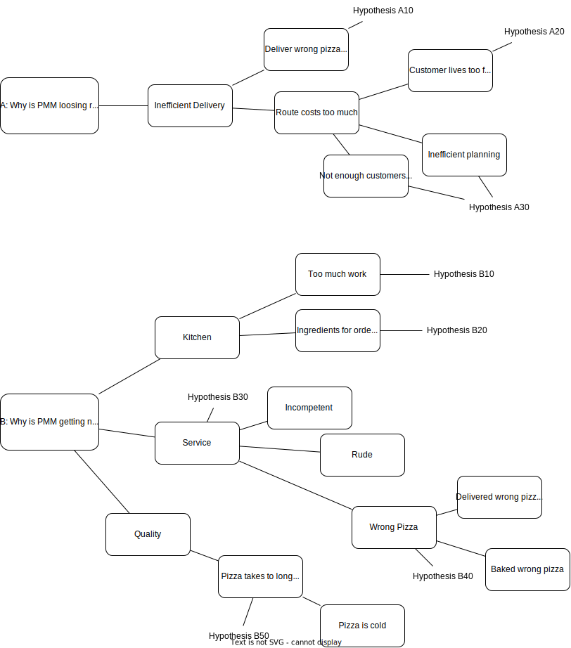
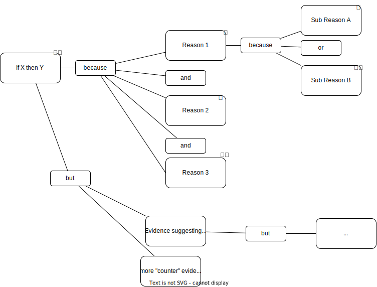
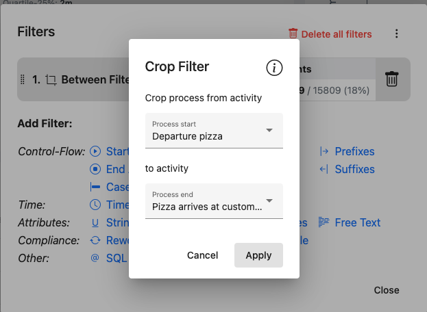
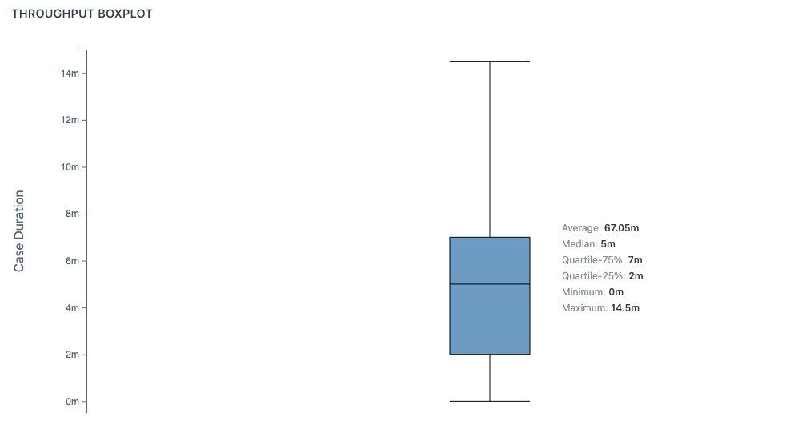
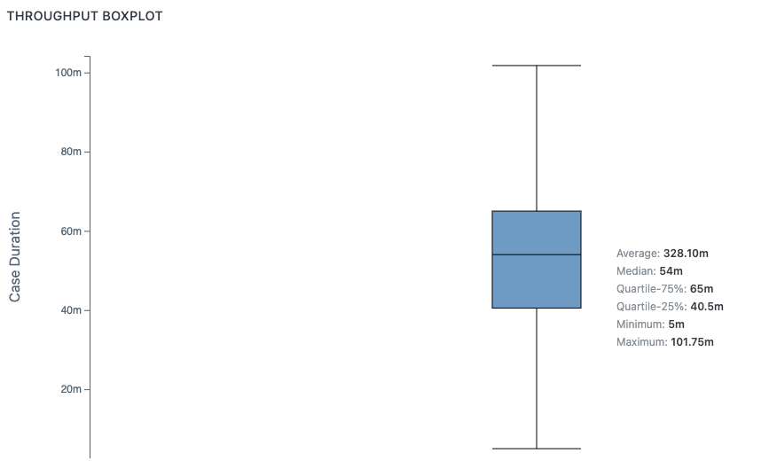
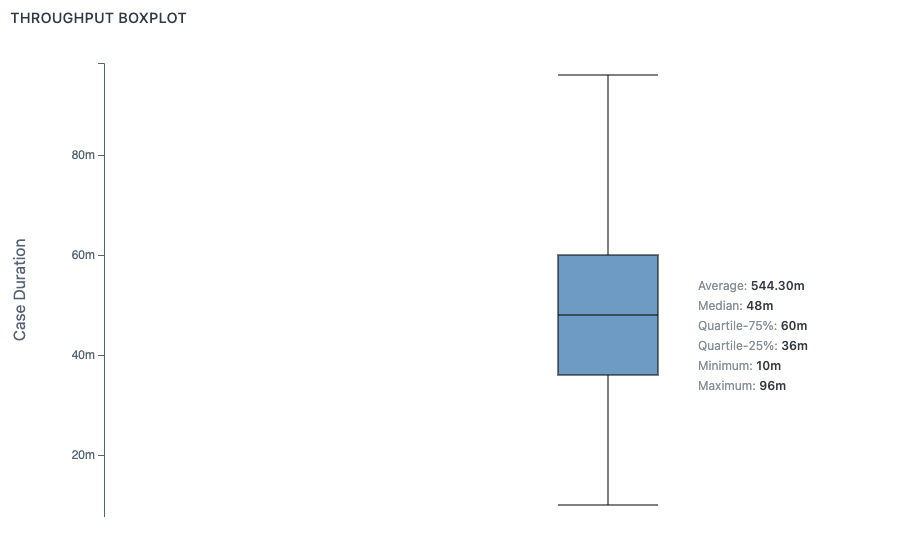
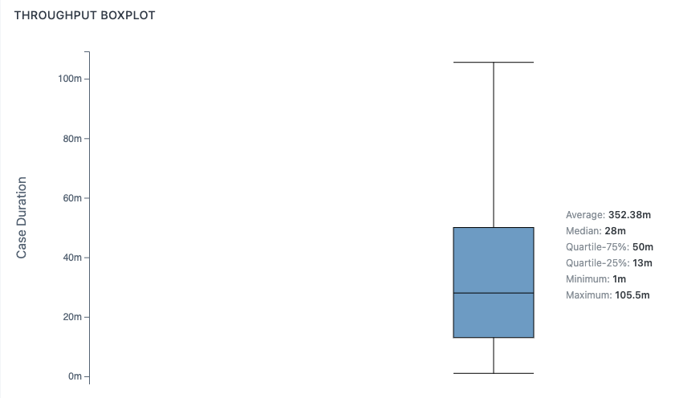
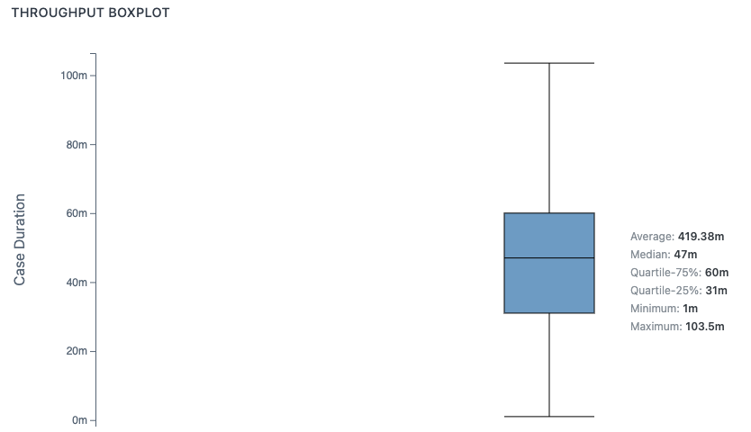
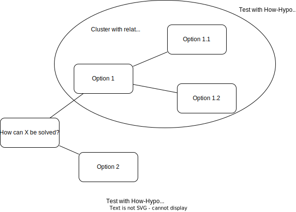

# About the framework

[Manual](Manual.md)

# Abkürzungen

PMM: Pizzeria Mamma Mia

# What is the problem?

The Pizzeria is **losing revenue on some deliveries** and gets **negative ratings** from customers

Split up in two part problems:
A: Loosing revenue on some delivereis
B: Negative ratings

Note: Negative ratings is B because A influences B but B does not influence A. So solging A gives part of the solution for B.

# Why?

Why is this a problem in the first place? Include a MindMap outlining reasons and cluster realated reasons (results in fewer hypothesis later).

## Hypothesis

Formulate hyothesis about each why cluster and include all relevant evidence that lead to the decition of accept / reject so it can be retested and a decition can be understood at a later time.

Tipp: Try to formulate hypothesis in a way that they can be tested easily like "If X then Y" in this example easy boolean logic can be applied.

<!--

### ✅ / ⛔️ / ❓ Hypothesis 1

Status: Accepted / Rejected / Insufficient Evidence to Accept or Reject

Reasoning:
Why is this hypothesis accepted / rejected

Sometimes mapping the hypothesis in an argument map like this can help applying boolean logic and testing the hypothesis:

-->

Note:
- Pizza received is only tracked for Orders originating from the website

### ⛔️ Hypothesis A10: Customers get the wrong Pizza delivered
Reject because All orders are being payed.

Assumption: Customer get the wrong Pizza if:
- We have to Bake a new Pizza after a Pizza was already dispatched to a customer.
- The customer does not pay after receiving the Pizza.

Results from Data:
- All orders originating from the website are being payed long before they are being dispatched
- Orders at the counter are not being dispatched
- All orders by phone are being payed towards the end of the process wether they are being dispatched or not

Source: PMTK Sunburst chart filted by each order method. Eyballing the parts of the ring that have on of the payment activities in it.

### ⛔️ Hypothesis A20: Customers live too far away for the route to be profitable
Reject because the mean throughput time between "Departure pizza" and "Pizza arrives at customer" has a median of 5m.

- Assumption: If it takes longer to deliver a Pizza to a customer that means a customer lives further away
- Assumption: Delivery within 15km is reasonable.
- Assumption: It takes 20 minutes to drive to a customer 15km away.
- Assumtpion: Every delivery that takes longer than 20 minutes is too far away to be profitable.

### ⛔️ Hypothesis A30: The route is not profitable because it's inefficient (eg. by not having enough customers along the route)
Rejected because as A20 found customers get their deliveries within 5m which means planning a route would provide us with neglectable results.

Assumption: It is inefficient if:
- The planning route was left out
- Planning happened after the Pizza already departed

### Hypothesis B10: The kitchen is overloaded with work
Assumption: The kitchen is overloaded if not all Pizza orders are being finished.

### Hypothesis B20: The ingredients for ordered Pizzas are not available

### ❓ Hypothesis B30: The service is bad (either incompetent or rude)
Unaware of how the event log would help to test this hypothesis. Maybe testing out the service "undercover" would be a suitable test.

### ⛔️ Hypothesis B40: Customers receive the wrong Pizza
Rejected because A10 was rejected which had the same basis

### ✅ Hypothesis B50: The customer has to wait too long for the Pizza
Accept because if a customer orders by website or phone they wait around an hour which is too long.

- All events throughput time median: 43m.
- Order at counter: **12m** (Filtered by start event "order at counter")
- Order from website:  **54m** (Filtered by start event "start order website")
- Order by phone (picked up and delivered): **48m** (Filtered by start event "order by phone")

Throughput time for orders originating from website

Throughput time for orders originating from phone

This can also be seen when splitting the dataset into satisfied customers (3-5 stars) and unsatisfied customers (0-3 stars).

filtered 3to5 stars

filtered 0to3 stars

### ⛔️ Hypothesis AB10: The case attributes (customer location, customer type, pizza type, pizza size, ...) have a direct influence on rating or revenue
Reject: Tested with HypothesisNotebooks/HA10.ipynb using a random forrest algo trained by using the attributes as features. Each feature has a neglectable influence on the output.

<!--
# How?

Brainstorm ideas on how to solve the problem in a mind map here.

## Hypothesis

Formulate hypothesis and cluster again but this time the hypothesis is meant to check how valuable each course of action would realy be. Eg. "Doing X is a worthwhile effort to solve this problem".

# Do

Now strategice / Plan any actions that are woth taking as outlined in the how part. And execute them.

Sometimes not all viable options can be taken at the same time use Network diagrams or Weighted Sum Analysis to make a decition on which to take.

-->
